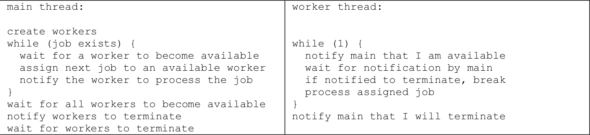

# ConcurrentProgrammingC
Concurrent Programming in C language

This respository contains 4 different ways of achieving Concurrent Programming making sure that the application would run as it should with the all possible context-switching between threads, as today's modern systems have more than one processor that are running switching between different threads and processes. <br>

All of the projects are creating threads through C p_thread_create function.<br>
Each project has 2 or 3 programs that cover possible real multi-threaded programs.<br>

The implemented methods are:
- Active Waiting
- Semaphores
- Monitors
- Critical Regions
  
Also the last project is an implementation of a possible multi-threaded system.<br>

The basic programs that are being implemented with these different ways are three.

- Master Thread that provides work to worker threads.
- Competitive Threads that each one try to reach its critical section first.
- Competitive Threads in teams where they are trying to reach in the critical section in teams.


## Master Thread and Worker Threads

These programs are checking for prime numbers. <br>


<br>
In order to run the program you should compile with the Makefile. <br>
```bash
make
```
and then you can run giving as arguments the number of threads that will run and a list of numbers that the program will check if they are prime or not. <br>
eg.<br>
```bash
./prime_reg 3 1 3 5 7 11 13 17 19 2 4 6 8 9 10
```

In this part of the projects there is the master thread (main process) that creates a number of threads and provides them work to do, while it waits for their results.

## Competitive Threads in Teams

These programs are implementing a narrow bridge that cars want to cross from both sides.<br>
The cars are separated into red and blue and having the thread role.<br>
When the bridge is empty whichever car from one direction reaches the bridge then the bridge can only get cars heading to the same direction with the first one. When all of them leave the bridge there is another competition as which car will arrive there first to cross the bridge. <br>

In order to run the program you need to provide the number of how many cars from one direction the bridge can handle as well as the number of cars for each direction.
eg.
```bash
./bridge 3 15 7
```

3 maximum number of cars the bridge can handle at once <br>
15 cars going to one side<br>
7 cars going the other side<br>
The different directions for the cars are being showed by the colour. <br>

## Competitive Threads

These programs are implementing a roller-coaster from a park.<br>
Each thread is a participant to the roller-coaster that runs to get a place before it's full.<br>
The train thread has the role of the roller-coaster while the rest of the threads have the passengers role.
The roller-coaster waits to get full of to start the ride which lasts for some seconds <br>
The passengers if they reach the roller-coaster before it's full they sit, declaring their seat and when the ride finishes they are leaving their seat for the next passengers.<br>
If there aren't enough passengers to fill all the seats then the roller-coaster is being notified that there aren't any more passengers and starts anyway.<br>

In order to run the program you need to provide the available seats the roller-coaster can have and the number of the passengers.<br>
eg.
```bash
./train 5 33
```

5 seats inside the roller-coaster.<br>
33 passengers in total wanting to get a ride.<br>
